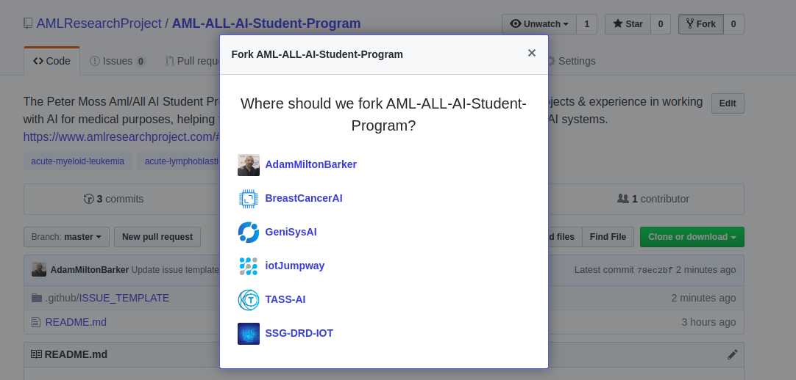
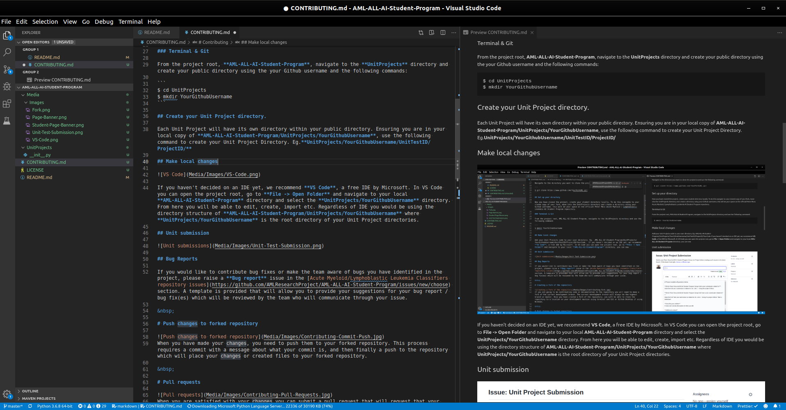
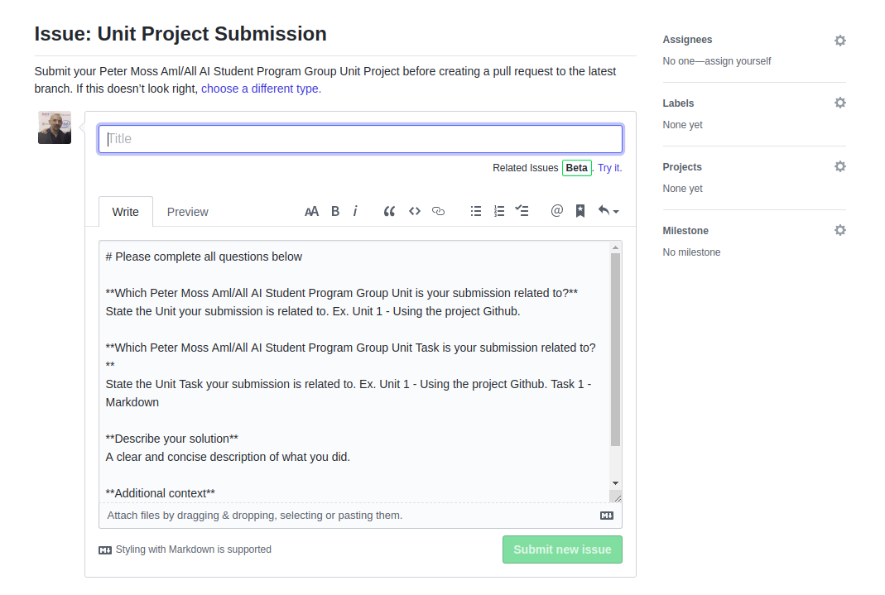
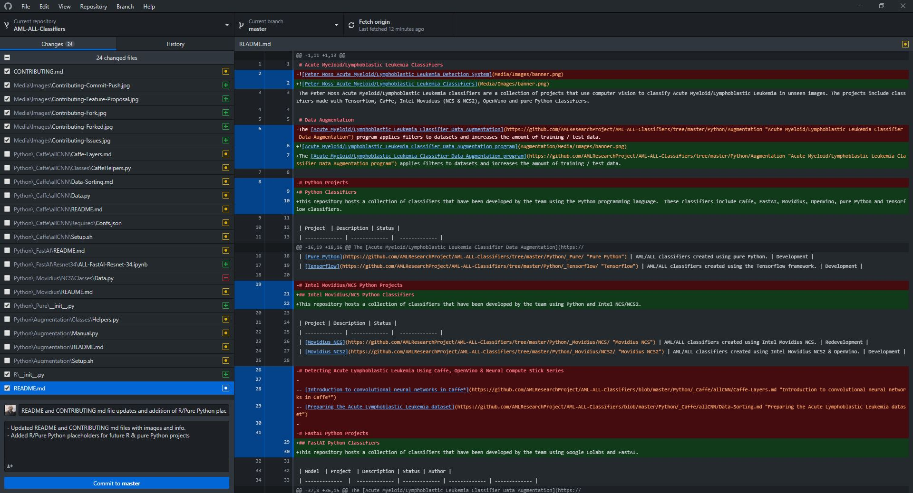

# Contributing


We encourage students to submit their Unit Projects to this repository. Please follow the steps below to do so.

If you would like to volunteer to the research project or student program as a professional, please use the contact form and select **Professional Volunteer**.

# Bug Reports

If you would like to contribute bug fixes or make the team aware of bugs you have identified in the project, please raise a **Bug report** issue in the [Acute Myeloid/Lymphoblastic Leukemia Classifiers repository issues](https://github.com/AMLResearchProject/AML-ALL-AI-Student-Program/issues/new/choose) section. A template is provided that will allow you to provide your suggestions for your bug report / bug fix(es) which will be reviewed by the team who will communicate through your issue.

# Creating a fork of the repository


If you are going to submit your unit project, you will need to first make a fork of the current development branch. The current development branch will always be the highest branch or master.

Once you have created a fork of the repository, you should clone the repository to a location on your development machine using terminal and Git, or Github Desktop if using Windows. If you are using terminal and Git you can use the following code, to download on Github Desktop ensure that Github Desktop is open and select the option from the github repository root.

## Terminal & Git

Navigate to the directory you want to clone the project to and use the following command:

```
$ git clone https://www.github.com/YourForkURL.git
```

# Set up your local directory

Now you have cloned the project, create your student directory locally. To do this navigate to your cloned copy of your fork, move into the UnitProjects directory and create a directory using your Github username, this will be your Unit Project space on the official Peter Moss Acute Myeloid / Lymphoblastic Leukemia AI Student Program Github repository.

## Terminal & Git

From the project root, **AML-ALL-AI-Student-Program**, navigate to the **UnitProjects** directory and create your public directory using the your Github username and the following commands:

```
$ cd UnitProjects
$ mkdir YourGithubUsername
```

# Create your Unit Project directory.

Each Unit Project will have its own directory within your public directory. Ensuring you are in your local copy of **AML-ALL-AI-Student-Program/UnitProjects/YourGithubUsername**, use the following command to create your Unit Project Directory. Eg.**UnitProjects/YourGithubUsername/UnitTestID/ProjectID/**, replacing UnitTestID with your actual Unit Test ID and ProjectID with your Unit Test Project ID.

```
$ mkdir UnitTestID && cd UnitTestID && mkdir ProjectID
```

# Make local changes



If you haven't decided on an IDE yet, we recommend **VS Code**, a free IDE by Microsoft. In VS Code you can open the project root, go to **File -> Open Folder** and navigate to your local **AML-ALL-AI-Student-Program** directory and select the **UnitProjects/YourGithubUsername** directory. From here you will be able to edit, create, import etc.

Regardless of IDE you would be using the directory structure of **AML-ALL-AI-Student-Program/UnitProjects/YourGithubUsername** where **UnitProjects/YourGithubUsername** is the root directory of your Unit Project directorie.

# Unit submission



The first step is to create your Unit Submission. This will provide information about your Unit Project(s) you are submitting.

&nbsp;

# Push changes to forked repository


When you have made your changes, you need to push them to your forked repository. This process requires a commit with a message about what your commit is, and then finally a push to the repository which will place your changes or created files to your forked repository.

&nbsp;

# Pull requests

When you are satisfied with your changes you can submit a pull request that will request that your changes be pulled into the latest development branch.

## Pull Request Process

1. Update all related README.md files with details of changes.
2. Add new README.md files for new directories, please include README branding.
3. Ensure that your READMEs documentation and code match the format/design of the rest of the repository.
4. Include the project header banner on all documentation pages / READMEs.
5. Include the Contributing, Versioning, Licensing, Bugs/Issues information in all READMEs and documentation.
6. Submit your Pull Request with an accurate description of the changes you have made.
7. Your Pull Request will be reviewed by the team.

&nbsp;

# Code of conduct

Please note we have a code of conduct, please follow it in all your interactions with the project.

&nbsp;

## Our Pledge

In the interest of fostering an open and welcoming environment, we as contributors and maintainers pledge to making participation in our project and our community a harassment-free experience for everyone, regardless of age, body size, disability, ethnicity, gender identity and expression, level of experience, nationality, personal appearance, race, religion, or sexual identity and orientation.

&nbsp;

## Our Standards

Examples of behavior that contributes to creating a positive environment include:

- Using welcoming and inclusive language
- Being respectful of differing viewpoints and experiences
- Gracefully accepting constructive criticism
- Focusing on what is best for the community
- Showing empathy towards other community members

Examples of unacceptable behavior by participants include:

- The use of sexualized language or imagery and unwelcome sexual attention or advances
- Trolling, insulting/derogatory comments, and personal or political attacks
- Public or private harassment
- Publishing others' private information, such as a physical or electronic address, without explicit permission
- Other conduct which could reasonably be considered inappropriate in a professional setting

&nbsp;

## Our Responsibilities

Project maintainers are responsible for clarifying the standards of acceptable behavior and are expected to take appropriate and fair corrective action in response to any instances of unacceptable behavior.

Project maintainers have the right and responsibility to remove, edit, or reject comments, commits, code, wiki edits, issues, and other contributions that are not aligned to this Code of Conduct, or to ban temporarily or
permanently any contributor for other behaviors that they deem inappropriate, threatening, offensive, or harmful.

&nbsp;

## Scope

This Code of Conduct applies both within project spaces and in public spaces when an individual is representing the project or its community. Examples of representing a project or community include using an official project e-mail address, posting via an official social media account, or acting as an appointed representative at an online or offline event. Representation of a project may be further defined and clarified by project maintainers.

&nbsp;

## Enforcement

Instances of abusive, harassing, or otherwise unacceptable behavior may be reported by contacting the project team at github@amlresearchproject.com. All complaints will be reviewed and investigated and will result in a response that is deemed necessary and appropriate to the circumstances. The project team is obligated to maintain confidentiality with regard to the reporter of an incident. Further details of specific enforcement policies may be posted separately.

&nbsp;

Project maintainers who do not follow or enforce the Code of Conduct in good faith may face temporary or permanent repercussions as determined by other members of the project's leadership.

&nbsp;

# Attribution

This Code of Conduct is adapted from the [Contributor Covenant][homepage], version 1.4, available at [http://contributor-covenant.org/version/1/4][version]
