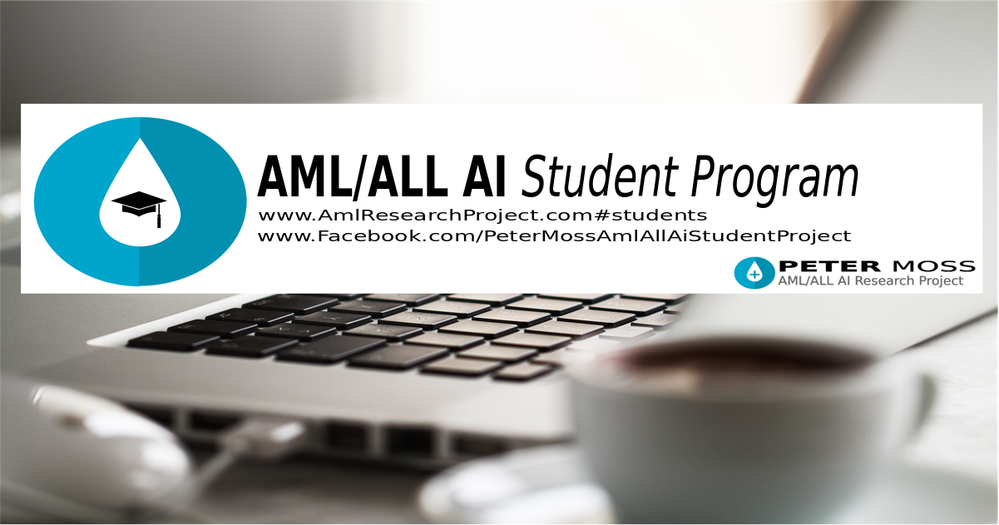
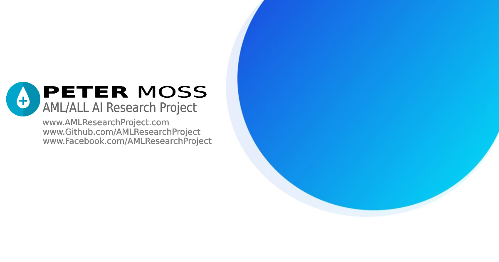

# The Peter Moss Acute Myeloid / Lymphoblastic Leukemia AI Student Program

The Peter Moss Aml/All AI Student Program​ provides college & university students with real world projects & experience in working with AI for medical purposes, helping further their education and understanding of real world medical AI systems.

The Student Program is headed by Peter Moss Aml/All AI Research Project​ team members [Ho Leung Ng](https://github.com/holeung "Ho  Leung Ng")​ - Dept. Biochemistry & Molecular Biophysics @ Kansas State University, and [Amita Kapoor](https://github.com/amita-kapoor "Amita Kapoor")​ - Associate Professor @ Delhi University.

In addition to working with your tutors, you will be able to communicate through the group with fellow team members [Adam Milton-Barker](https://github.com/AdamMiltonBarker "Adam Milton-Barker"), Estela Sóc-de Ribes​, Salvatore Raieli​ & Rishabh Banga​.

If you would like to join the Student Developer Program please answer the questions on the [Private AML/ALL AI Student Program Chat Group​](https://www.facebook.com/groups/AmlAllPrivateStudentAiProgram "Private AML/ALL AI Student Program Chat Group​").

The Peter Moss AML/ALL AI Student Program is entirely free! Approved students will learn how to develop AI for medical use cases using open source tools. Please understand that due to the size of our team, not all requests can be approved immediately.

If you would like to volunteer to the research project or student program as a professional, please use the contact form on our website and select **Professional Volunteer**.

The Peter Moss Acute Myeloid / Lymphoblastic Leukemia AI Research Project is an open source project with the goals of leveraging Artificial Intelligence to help detect AML/ALL and discover potential candidates for drugs to help combat the diseases. The project is in memory of Peter Edward Moss who lost his battle with Acute Myeloid Leukemia in August 2019.

The project is being coordinated by a group of volunteers with experience in computer vision / natural language processing, Leukemia research, Biochemistry, Molecular Biophysics, Immunology and Bioinformation.

The purpose of the project is to share public information related to AML/ALL, as well as open source projects aimed at early dectection with convolutional neural networks, using natural language understanding for AML/ALL chatbots, and R&D for discovering potential candidates for drugs for AML/ALL.

# Related Links

- [AML/ALL AI Students](https://www.amlresearchproject.com/#students "AML/ALL AI Students")
- [AML/ALL AI Students on Facebook](https://www.facebook.com/PeterMossAmlAllAiStudentProject "AML/ALL AI Students on Facebook")
- [AML/ALL AI Students Private Group on Facebook](https://www.facebook.com/groups/AmlAllPrivateStudentAiProgram "AML/ALL AI Students Private Group on Facebook")

# Contributing

We welcome contributions of the project. Please read [CONTRIBUTING.md](https://github.com/AMLResearchProject/AML-ALL-AI-Student-Program/blob/master/CONTRIBUTING.md "CONTRIBUTING.md") for details on our code of conduct, and the process for submitting pull requests.

# Versioning

We use SemVer for versioning. For the versions available, see [Releases](https://github.com/AMLResearchProject/AML-ALL-AI-Student-Program/releases "Releases").

# License

This project is licensed under the **MIT License** - see the [LICENSE](https://github.com/AMLResearchProject/AML-ALL-AI-Student-Program/blob/master/LICENSE "LICENSE") file for details.

# Bugs/Issues

We use the [repo issues](https://github.com/AMLResearchProject/AML-ALL-AI-Student-Program/issues "repo issues") to track bugs and general requests related to using this project.
